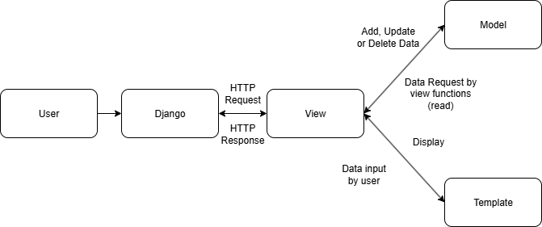

Checklist pertama 
Membuat proyek django: sebelum membuat proyek django kita perlu menyiapkan environtment tersendiri agar terisolasi dan tidak bertabrakan dengan sistem/versi di komputer kita, setelah itu kita membuat requirements.txt yang berisi dependencies/ library external untuk proyek kita. Setelah itu install dan start proyek django. 

Checklist kedua
Membuat aplikasi dengan nama main pada proyek tersebut: untuk membuat aplikasi main kita perlu menjalankan command python manage.py startapp main pada direktori football-shop setelah dijalankan akan ada direktori baru dengan nama main, kemudian daftarkan aplikasi main ke proyek footbal_shop melalui INSTALLED APPS pada settings.py.

Checklist ketiga
Melakukan routing pada proyek agar dapat menjalankan aplikasi main: untuk melakukan routing import fungsi include dan path untuk mengimpor pola url dari aplikasi dan untuk mengenali pola url. Tambahkan rute URL dengan path ini akan mengarahkan url ke rute yang didefinisikan pada aplikasi yang kita buat

Checklist keempat
Membuat model pada aplikasi main dengan nama Product dan memiliki atribut wajib sebagai berikut: pada main yang telah kita buat, sudah tersedia models.py kita import model dan buat class product(models.Model) yang berisi spesifikasi model dengan nama dan tipe data yang sesuai dengan yang diinginkan.

Checklist kelima
Membuat sebuah fungsi pada views.py untuk dikembalikan ke dalam sebuah template HTML yang menampilkan nama aplikasi serta nama dan kelas kamu: menggunakan django shortcut render.Kita membuat fungsi yang menerima parameter request, views.py akan mengatur permintaan dan mengembalikan tampilan yang diinginkan pada html. Setelah itu kita perlu memodifikasi html kita sesuai context yang berbentuk array pada fungsi di views.py

Checklist keenam
Membuat sebuah routing pada urls.py aplikasi main untuk memetakan fungsi yang telah dibuat pada views.py: import path untuk mendefinisikan pola url. app_name='main' digunakan untuk nama pada aplikasi, kemudian membuat list urlpatterns yang berisi URLPattern yang dihasilkan fungsi path. Jika url cocok dengan pola yang ditentukan maka akan memanggil fungsi di views.py untuk menampilkan pada html

Checklist ketujuh
Melakukan deployment ke PWS terhadap aplikasi yang sudah dibuat sehingga nantinya dapat diakses oleh teman-temanmu melalui Internet: mengkonfigurasi file .env dan membuat file .env.prod untuk development lokal dan deployment pada PWS. Dilanjut dengan memodifikasi settings.py untuk load environment pada file .env serta mengisi daftar host yang diizinkan untuk mengakses aplikasi web. Kemudian membuat new project pada PWS dan menambahkannya pada allowed host sesuai url deployment pws. Terakhir lakukan commit pada pws untuk melakukan perubahan program

Checklist kedelapan
Membuat sebuah README.md yang berisi tautan menuju aplikasi PWS yang sudah di-deploy, serta jawaban dari beberapa pertanyaan berikut:

##Kaitan Url, View, Model, dan HTML 

1. Mendapat request dari user melalui django memberikan request http
2. Dilanjutkan proses identifikasi melalui urls.py dengan fungsi pada views.py
3. Apabila  cocok views.py akan mengadd model sesuai dengan fungsi pada views.py
4. views.py juga akan mendisplay tampilan pada template
5. Tampilan dikirim kembali ke views-django-user untuk ditampilkan ke user

Fungsi settings.py
Settings.py adalah tempat pengaturan atau konfigurasi utama untuk spesifikasi,behaviour dan environtment yang kita gunakan.

Bagaimana cara kerja migrasi database di Django?
Cara  kerjanya adalah setelah kita membuat perubahan kita perlu menjalankan perintah python manage.py makemigrations ini akan membuat berkas yang berisi perubahan model yang belum diaplikasikan ke basis data. Kemudian kita jalankan perintah python manage.py migrate untuk melakukan migrasi tersebut

Menurut Anda, dari semua framework yang ada, mengapa framework Django dijadikan permulaan pembelajaran pengembangan perangkat lunak?
Karena django memiliki alur yang jelas yaitu mengikuti pola MVT dan menggunakan python sebagai bahasa utama yang mana mudah dimengerti dan dipelajari

Apakah ada feedback untuk asisten dosen tutorial 1 yang telah kamu kerjakan sebelumnya?
Untuk saat ini tidak ada, karena asisten dosen dan dosen telah melaksanakan tugasnya dengan baik dan jelas. Terimakasih